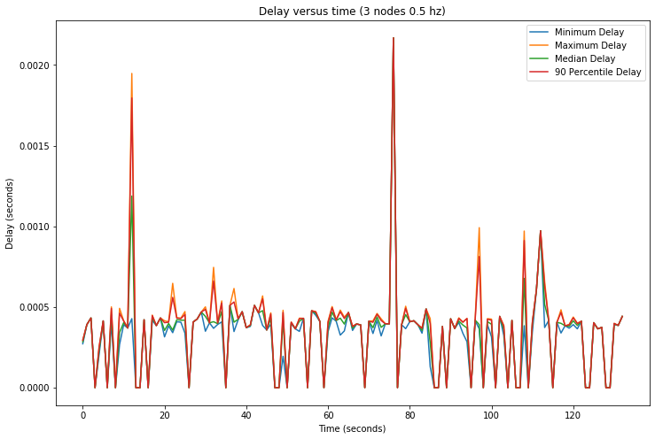
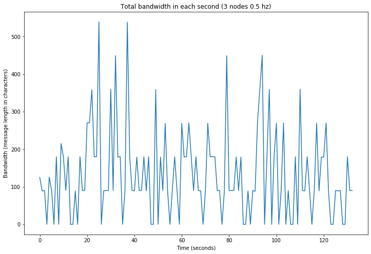
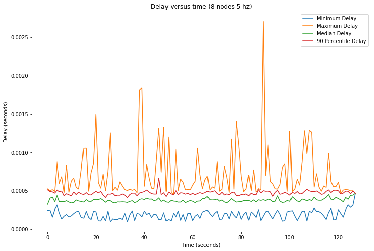
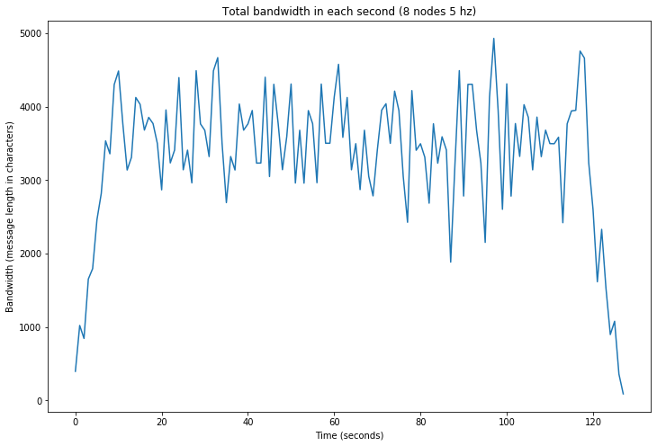

# CS425-MP0: Event Logging

## Cluster Name:

* **g34**

## Authors

* **Wenqian Ye(wenqian3)** 
* **Yunqian Bao(yunqian4)**

## URL and revision number

https://gitlab.engr.illinois.edu/wenqian3/cs425-sp2020/tree/master/MP0

Revision number: 0c3a55d8f080e43a6d1b1a4705d1164ecf307e32

## Usage

We use **logger.go** as our server and **node.go** as our client. Running **logger** would create a **log.txt** recording the events and corresponding time delay and bandwidth.

### To build the project
```
$ make
```

### To run the server:
```
$ ./logger [port]
```
[port] is the port number.

### To run the clients (you need to run the logger first):
```
$ python3 -u generator.py [freq] | ./node [node name] [server IP] [port]
```
[freq] is the frequency of the event generator, as defined in the MP document.

[node name] is the name of the node

[server IP] is the IP address of the centralized logging server (e.g. 10.0.0.1).

[port] is the port number that the centralized logging server is using.

### To stop running
Use `SIGINT` (`CTRL+C`) to stop the nodes and then the logging server.

### To generate graphs:
First make sure the following python packages are correctly installed: **numpy** and **matplotlib**

Then rename rename **log.txt** to **3.txt** or **8.txt**, judging from the number of clusters you are using. Then in **graph.py**, change the variable `profileNum` to 3 or 8 accordingly. Finally run **graph.py** in Jupyter notebook. 

Note: rename **log.txt** to which of **3.txt** and **8.txt** does not actually matter, this only affects the titles of the graphs, but make sure the file name and `profileNum` are consistent.

## Calculating time delay and bandwidth:
We calculate the delay by substracting the timestamp of the event and the timestamp when we are about to print the event in the logging server. And for each one-second time interval, we analyze the delays in that period and calculate min, max, medium, and 90-percentile delay for that second.

For the bandwidth, we simply record the length (in characters) of each message received by the logger, and in each one-second time interval, we add up the lengths and take the sum as the bandwidth in that second.

For each event, the delay and the message length is calculated by the logging server and stored in **log.txt**. And further calculations are performed by **graph.py**.

## Evaluation and Graphs:

We evaluated our system in the following senarios:

* 3 nodes, 0.5 hz each, running for at least 100 seconds

* 8 nodes, 5 hz each, running for at least 100 seconds

The according **log.txt** are uploaded as **3.txt** and **8.txt**, and by running **graph.py** we generate the following graphs:










