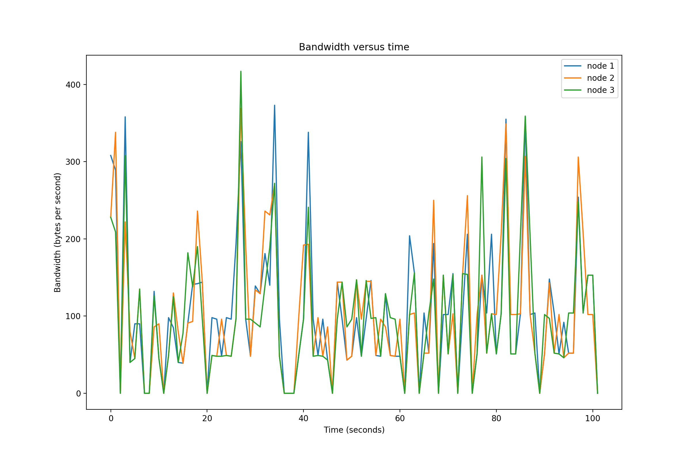
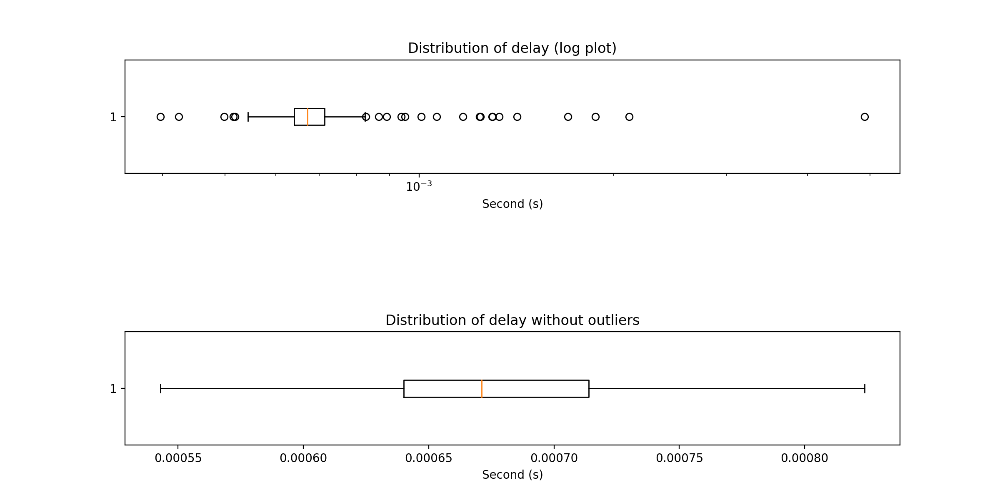
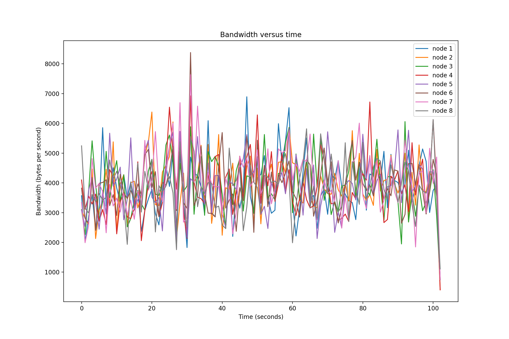
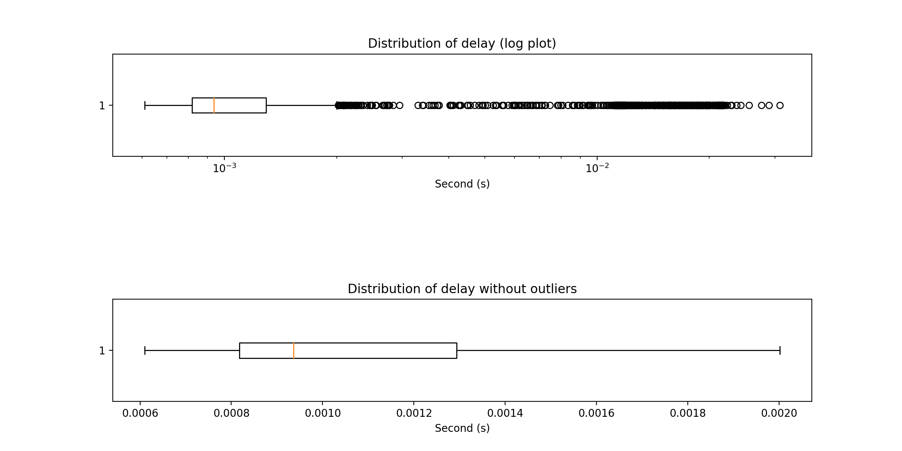
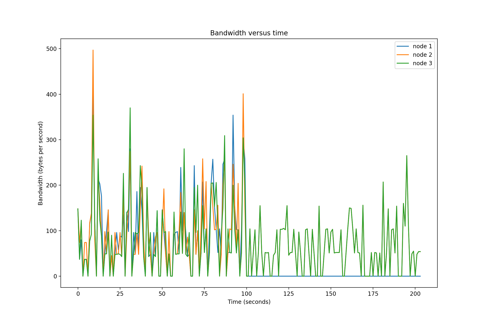
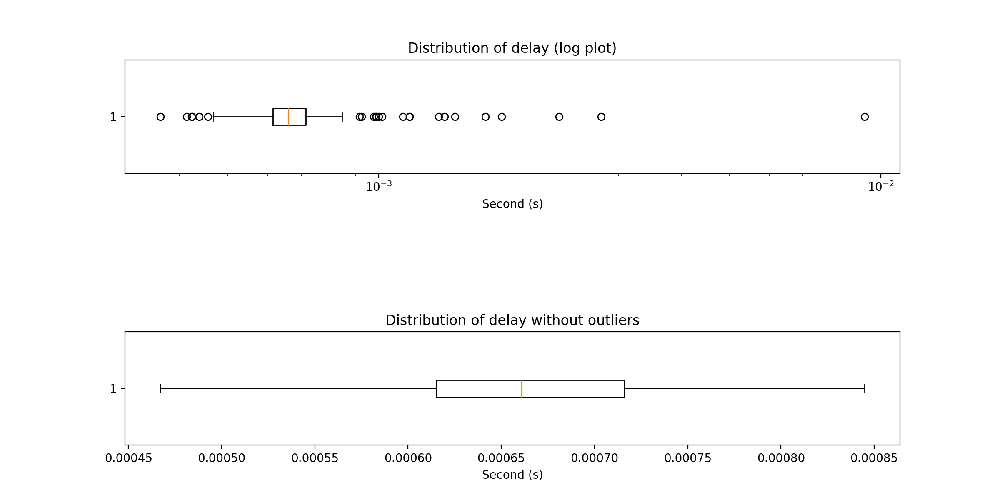
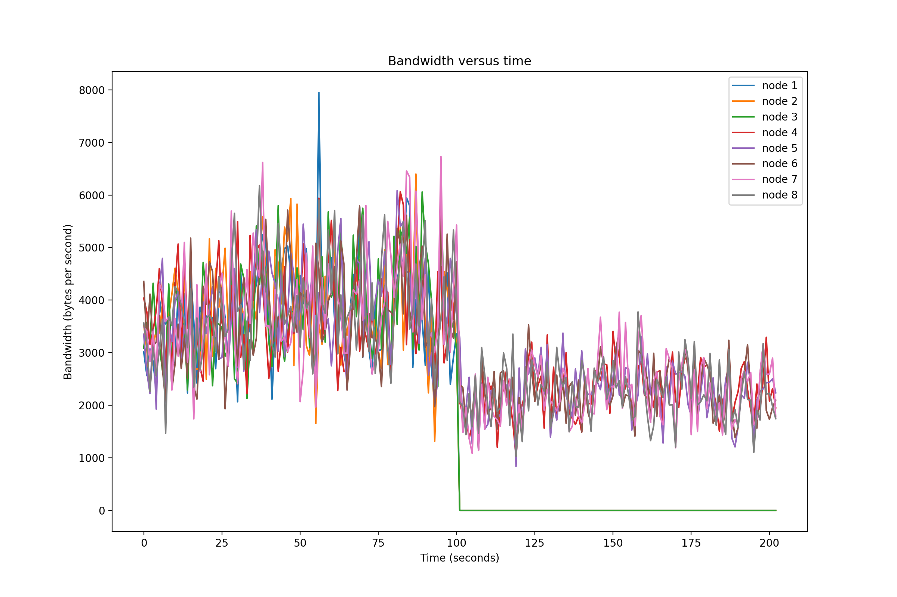
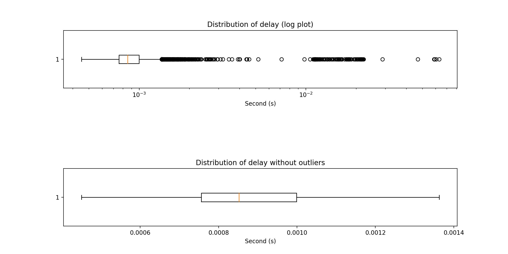

# CS425-MP1: Event Ordering

## Cluster Name:

* **g34**

## Authors

* **Wenqian Ye(wenqian3)** 
* **Yunqian Bao(yunqian4)**

## URL and revision number

https://gitlab.engr.illinois.edu/wenqian3/cs425-sp2020/tree/master/MP1

Revision number: 584daa3899c04adf7bb32973cbcfaab07ab8b689

## Design document

Above all, for convenience, we:

* use TCP to send or receive messages
* hardcode the IP addresses of all nodes and put them into an array
* use `SIGINT` to stop a process

We implement ISIS algorithm to ensure total ordering:

If a node receives a transaction from the python script, it will multicast the message to all alive nodes. When a node receives a multicasted transaction, it replies with a priority that is larger than any priority it has observed or received, and then it stores the transaction in a priority queue sorted by proposed or final priority (node ID is used to break ties). After receiving proposed priority from all nodes, the node that generates the transaction choose the max priority and broadcasts the finalized max priority, meanwhile setting the transaction as deliverable. When a node received a finalized max priority, it sets the transaction as deliverable. Each time a transaction is labelled as deliverable, the node delivers all deliverable messages at front of the priority queue.

To ensure reliable delivery under failures, we made several adjustments to the program and ISIS algorithm:

* First, when we stop a process with `SIGINT`, we catch the signal and set an **interrupted** variable to **true**, and all working threads checks the **interrupted** flag before each loop and breaks if **interrupted**. In this way, we ensures each multicast is a successful broadcast because the program does not exit halfway in a multicast job (also we use TCP).

* We only send/receives messages from alive nodes.

* If all alive processes have proposed a priority, we set the transaction as deliverable, ignoring the dead processes

* If we have not sent proposed priority of a transaction, but the node generating the transaction is dead, we simply delete it from the priority queue

* If we have not received a final priority of a transaction, but the node generating the transaction is dead, we simply delete it from the priority queue

The above adjustments would ensure reliable delivery and total order under failures because we have considered all stages of a transaction in which a failed node may cause error.

## Usage

In each node, we use **mp1_node.go** as both server and client. Running **mp1_node.go** would create **log.txt** and **bandwidth.txt** recording corresponding bandwidth and timestamp (First Message or Last Message) in each node.

The balance in each node will be printed in console every 5 seconds.

### To build the project

```
$ make
```

### To run the server:

```
$ python3 -u gentx.py [freq] | ./mp1_node [node number] [port]
```

[freq] is the frequency of the event generator, as defined in the MP document.

[node number] is the number of nodes running in this system.

[port] is the port number that each node will use.

### To stop running

Use `SIGINT` (`CTRL+C`) to stop the nodes.

### To clean the executable

```
$ make clean
```

### To generate graphs:

First make sure the following python packages are correctly installed: **numpy** and **matplotlib**

Rename the **log.txt** and **bandwidth.txt** in each node as **log[i].txt** and **bandwidth[i].txt**, where i denotes which virtual machine we are using (i.e. i is 1 when we are using VM1). For each scenario, put all results into the corresponding folder in **MP1-data**. 

Then in **graph.py**, change the variable `profileNum` to 1, 2, 3, 4 according to which scenario you are analyzing. Finally run **graph.py** in Jupyter notebook. This program will give you two graphs. One is the bandwidth among all running nodes. The other is the distribution of the time intervals for each event between the first time the event generated and the last time it get processed.

## Calculating bandwidth and time delay:

We calculate the delay by substracting the time when an event is generated and the last time when this event get processed. 

For the bandwidth, we simply record the length (in characters) of each message received and sent by the node, and in each one-second time interval, we add up the lengths and take the sum as the bandwidth in that second. We store the results in **bandwidth.txt**.

For each event, the delay and the message length is calculated by the logging server and stored in **log.txt**. And further calculations are performed by **graph.py**.

## Evaluation and Graphs:

We evaluated our system in the following senarios:

* 3 nodes, 0.5 Hz each, running for 100 seconds
* 8 nodes, 5 Hz each, running for 100 seconds
* 3 nodes, 0.5 Hz each, runing for 100 seconds, then one node fails, and the rest continue to run for 100 seconds

* 8 nodes, 5 Hz each, running for 100 seconds, then 3 nodes fail simultaneously, and the rest continue to run for 100 seconds.

The according **log.txt** and **bandwidth.txt** in each node, and by running **graph.py** we generate the following graphs:

* 3 nodes, 0.5 Hz each, running for 100 seconds

  

  

* 8 nodes, 5 Hz each, running for 100 seconds

  

  

* 3 nodes, 0.5 Hz each, runing for 100 seconds, then one node fails, and the rest continue to run for 100 seconds

  

  

* 8 nodes, 5 Hz each, running for 100 seconds, then 3 nodes fail simultaneously, and the rest continue to run for 100 seconds

  

  
  
## Functionality testing
* We test the functionality by checking logs and realtime balances. 
* For low-scale testing, we check if all delivered transactions are in the same order for each node, we also check whether the realtime balances are consistent among nodes.
* For large-scale test, we simply check whether the balances are consistent among nodes upon stopping all nodes with `SIGINT`.
* We made changes to python script so that it could generate failing transactions, and then we print error messages to stderr if a node encounters an error when delivering a transaction. Finally we check if all nodes have the same sequence of failed transactions.
* To test with failures, we run all nodes for a while, stopping some of the nodes, and let the remaining run for a while, and finally stop the remaining nodes at the same time. Then we check whether the "remaining" nodes have the consistent balances and delivered transactions upon exit.

Our program has passed all above tests.