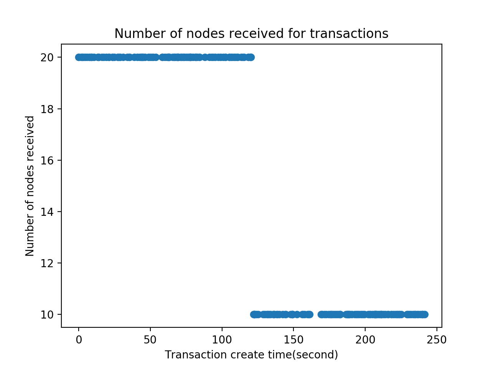
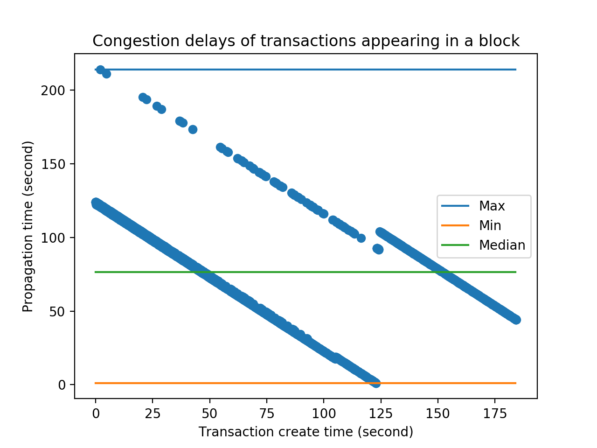
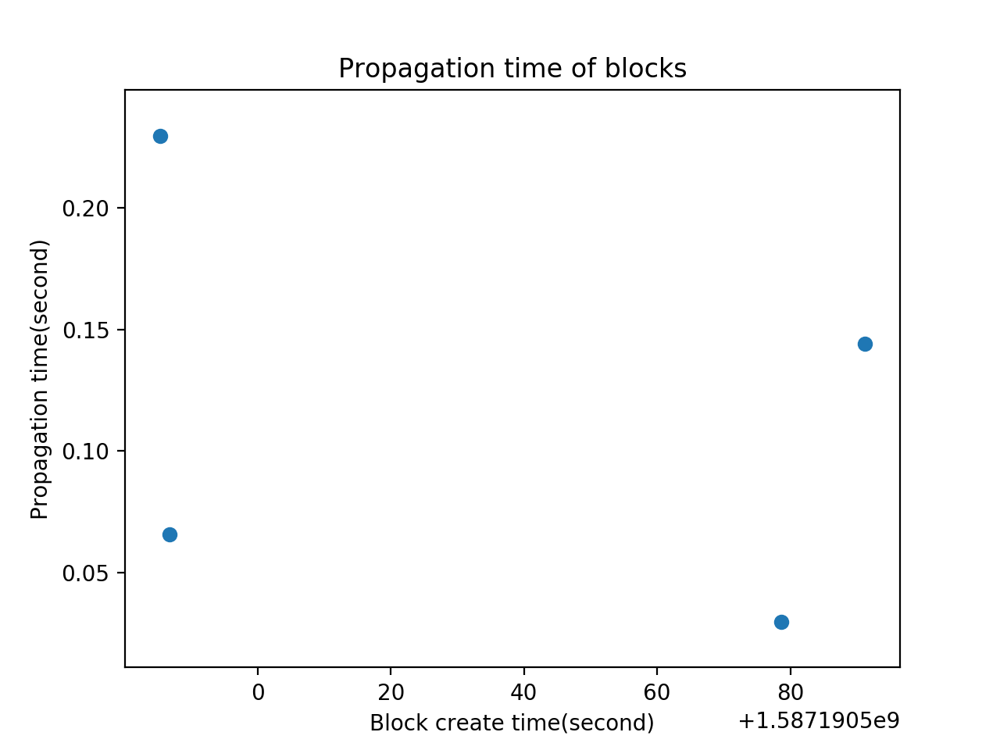

# CS425-MP2: Cryptocurrency

## Cluster Name:

* **g34**

## Authors

* **Wenqian Ye(wenqian3)** 
* **Yunqian Bao(yunqian4)**

## URL and revision number

https://gitlab.engr.illinois.edu/wenqian3/cs425-sp2020/tree/master/MP2

Revision number: b470f4b386b9db6499b63675154f3b177e2abe3c

# Introduction

In this MP, we implement some basic functionality of a cryptocurrency. In particular, we implement a peer-to-peer protocol to communicate transactions and blocks, rule verification to ensure transactions are well-formed, and Nakamoto consensus and its longest chain rule.

# Usage

### To run the server(both mp2_service and logger) on VM1: 
```
sh run<node number>-1.sh
```
```<node number>``` is the number of nodes running in our system.

For example, to run 20 nodes test case
```
sh run20-1.sh
```
The VM1 runs the introduction service and the logging service, so for convenience, we are not running any nodes on VM1.

### To run the clients on VM2 to VM10:
```
sh run<node number>-<VM id>.sh
```
For example, to run 100 nodes test case on VM10
```
sh run100-10.sh
```

Note that the script for VM1 should be run before running scripts on other VMs.

### To send a DIE command to half the nodes:
On server, type ````thanos```` and press return.

### To change rates of transactions and blocks

You may modify the following command in ```run<node number>.sh``` on VM1:

```
python3 mp2_service.py <port> <tx_rate> [block_rate]
```

```port``` is hardcoded as 4999 and should not be changed.

Also, all ports (including 4999, 4998 on VM1, and other ports on other VMs) are hardcoded, so you need to make sure these ports are available. You can do this by 
```
sudo fuser -k <port>/tcp
```
# Description of design

## 1. Connectivity
Assuming the neighbors of each node is random, to ensure that the whole graph is connected, we need the degree of each node to be at least half of the number of nodes in the graph. However, in the actual bitcoin system, we do not know the total number of nodes in the graph, and usually each node has 10 to 100 neighbors. Although it is nearly impossible to ensure that the graph is connected, we can find a way to build up the network so that the graph has a high possibility to be connected, even when half of the nodes (randomly picked) fail.

Assuming each node has a fail rate of 50 percent, we first find the possibility that a node has no neighbors after running the "thanos" command, and that number is (1/2)^k, where k is number of neighbors. Then we can have a vague estimation of the probability of the system remaining connected after killing half of the nodes randomly: (1-(1/2)^k)^n, given there are n nodes and each node has k neighbors. Note that this estimation is not precise, but it's the best we can do with such a simple model. 

Let n=100, as in our big testcase, and when k is around 15, the probability that the system is connected after killing 50 random nodes is around 99%. Therefore, we try to let our nodes have 16 connections each.

Then we consider the implementation in detail: 

The introduction service can "connect" random disconnected components of the graph by sending "INTRODUCE" commands. So when a node receives an "INTRODUCE" command, it dials to the nodes introduced. And in order to form a strongly connected component, the dialed nodes would forward the dialer to its neighbors, asking its neighbors to dial the dialer (if the dialed node has no other neighbor, then the dialed node dials back to the dialer).

But only three "INTRODUCE" commands usually are not enough be ensure 16 neighbors for each node. So when each node is running, it periodically checks whether it has 16 neighbors, and if not, it asks for its neighbors for more neighbors.

When a node fails, its neighbors would get error when attmpting to read or write from/into the socket, and that is how we detect failures. Note that when a node detects a failing neighbor, it would attempt to request more neighbors from its remaining living neighbors.


## 2. Transaction propagation
We use the push method to propagate transactions (flooding). Each time we receive a new transaction (either from introduction service or a neighboring node), we put the transaction in a set, and then resend them to all neighbors. The set (or in some languages, a map) maintains the transactions that has already been received and resended, and when we receive a transaction that has been received and recently resended, we simply ignore the transaction. In this way we can save bandwidth.

## 3. Transaction validity

When choosing valid transactions (either from the node's neighbors or the introduction service) to put into the new block, we first calculated the account balances from all previous blocks (a simple recursion would work). Next we sort all pending transactions in the order of time when the node first receives the transaction. Then for each pending transaction  that is previouly not used, we check whether it would create negative balances or not. If not, then it is a valid transaction and we put it in to the new block. After request and received a solution for the new block, we label all transactions in the new block as "used" and these transactions would not be used by this node in the future.

## 4. Block propagation
In order to broadcast We are using the same method as in transaction propagation: the push method (flooding). When a node receives a block, it sends a "VERIFY" command with the block's hash and puzzle solution to the introduction service, then the node labels the block as valid if it receives "VERIFY OK hash..." from the introduction server. But before the node adds the block to the block chain, it waits for all previous blocks on the blockchain to be received, otherwise we cannot calculate the account balances based on the incomplete block chain.

## 5. Info logged and graph generation
We have a central logger (see MP0) in VM1, and all nodes send information to the central logger. After all nodes are dead, the central logger saves all information to a `log.txt`, and then we run a `graph.py` to generate the graphs. The information logged includes: bandwidth at each second (number of bytes per second), each transaction and when they are received by each node, each block and when they are received by each node, when each transaction is added to each block, and when each chain split occurs as well as the length of chain split.


# Evaluation and Graphs
We evaluated our system in the following senarios:

* 20 nodes, 1 transaction rate, default block rate,  running for 4 minutes(thanos at 2 minute)
 
 
 
 
 

 No chain split in this case.


* 100 nodes, 20 transaction rate, default block rate, running for 4 minutes(thanos at 2 minute)
 
 
 
 
 

No chain split in this case.

At default block rate, even we run multiple times, we still cannot find any chain split, a possible reason is: the chances that a block is mined is too small (block rate too small).

